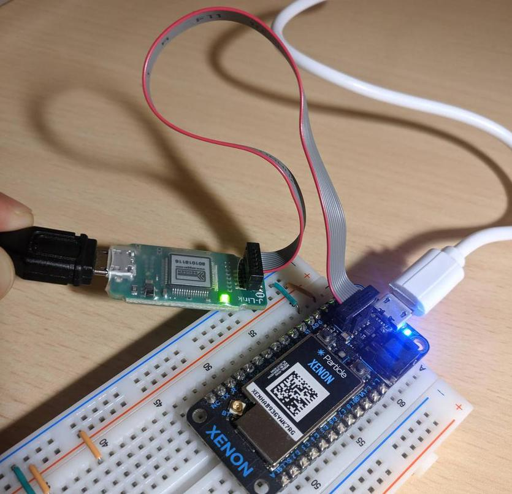

Requiremenets:

-   One of the Jlink products e.g. Jlink-mini EDU
-   One of the boards that support Jlink programmer e.g. Particle Xenon, Adafruit Feather...
-   Installed `nrfjprog` CLI

  

## Performing Backup

When getting a Particle Xenon board (or similar), it is a good pratice to perform a backup in case anything goes wrong or if you later want to quickly reflash the initial software. To do that run script `perform_backup.sh`. This will create two files `backupcode.hex` and `backupuicr.hex`. To later flash backup files back into the chip run `flash_from_backup.sh`.

## Installing Adafruit Firmware

Firmware consists of [softdevice](https://github.com/nordicsemiconductor/nrf5-sdk-for-mesh/tree/master/bin/softdevice) and [Adafruit bootloader](https://github.com/adafruit/Adafruit_nRF52_Bootloader/releases). Both can be flashed using `flash_hex.sh` script:

    ./flash_hex.sh particle_xenon_bootloader-0.4.0_s140_6.1.1.hex
    ./flash_hex.sh s140_nrf52_7.2.0_softdevice.hex

## Flashing and Debugging

To enable flashing platformio with jlink, add `upload_protocol = jlink` setting inside `platformio.ini` file within the project. To enable debugging through jlink add `debug_tool = jlink` within the same file.

Note: The first time after pressing debug, press contrinue until the program gets stuck, then press restart and debug process should proceed correctly. Dont forget to add some break points.

When debugging, to see hex values, inside debug console enter `set output-radix 16`, then variable values should be reported in hex format.

## Extra

Some helpful commands for `nrfjprog` util:

    nrfjprog -v # Get version
    nrfjprog -i # Get connected devices

Also `nrfutil` util, which allows performing DFU updates:

    pip2 install nrfutil # Install the dfu utils, seems to work on mac too!
    nrfutil version # Display version
    nrfutil dfu # Used to perform device firmware update, need to check out how

To see all available software tools visit [Nordic Dev Tools Website](https://www.nordicsemi.com/Software-and-tools/Development-Tools/).
